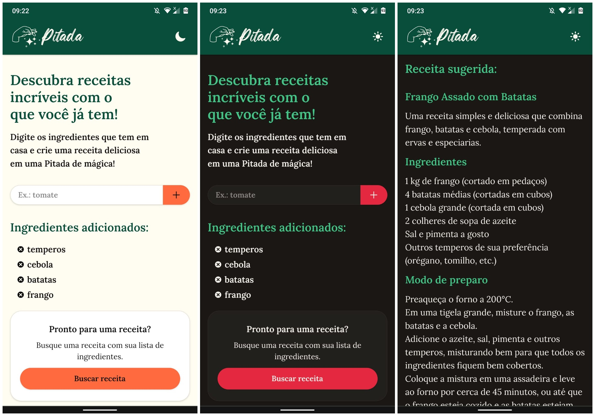
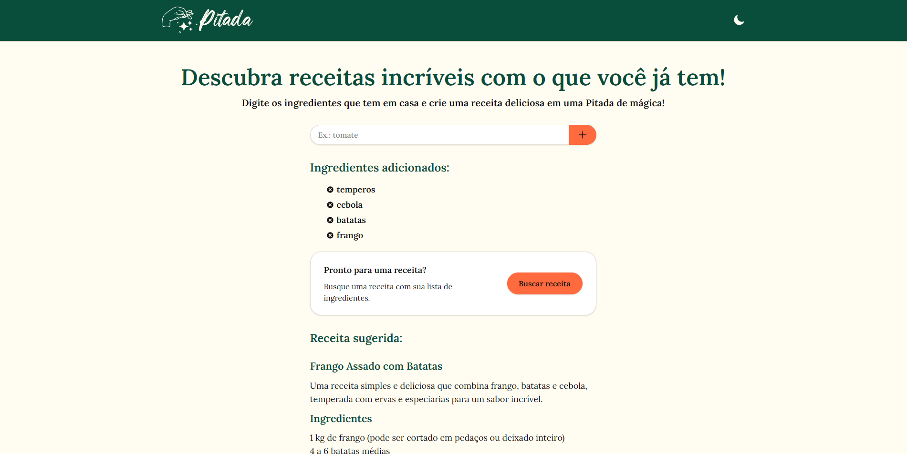

# 

**Pitada** é uma aplicação web inteligente que transforma ingredientes em receitas deliciosas usando o poder da inteligência artificial. Com uma interface responsiva e intuitiva, você pode descobrir novas possibilidades culinárias a partir dos ingredientes que tem em casa.


## 🌟 Funcionalidades

- **🤖 IA Culinária**: Gere receitas personalizadas usando inteligência artificial
- **🥗 Lista de Ingredientes**: Interface simples para adicionar e gerenciar ingredientes
- **🎨 Tema Dinâmico**: Alterne entre modo claro e escuro
- **📱 Design Responsivo**: Interface otimizada para desktop, tablet e mobile
- **♿ Acessibilidade**: Implementação completa de ARIA e navegação por teclado
- **🚀 PWA Ready**: Manifesto configurado para instalação como app nativo
- **⚡ Performance**: Otimizada com Next.js 15 e React 19

## 🛠️ Tecnologias


### Principais Dependências

- **Next.js 15.4.6**: Framework React com App Router
- **React 19.1.0**: Biblioteca de interface
- **Tailwind CSS v4**: Framework CSS
- **Groq SDK**: Integração com IA para geração de receitas
- **React Icons**: Biblioteca de ícones 


## 📸 Capturas de tela
### Mobile (PWA)


_Layout mobile (PWA)_

### Desktop


_Layout para telas desktop_

## 🚀 Instalação e Configuração

### Pré-requisitos

- Node.js 18+ ou superior
- npm, yarn, pnpm ou bun
- Chave da API Groq

### Passos de Instalação

1. **Clone o repositório**

   ```bash
   git clone https://github.com/diegocarmn/pitada.git
   cd pitada
   ```

2. **Instale as dependências**

   ```bash
   npm install
   # ou
   yarn install
   # ou
   pnpm install
   ```

3. **Configure as variáveis de ambiente**

   ```bash
   cp .env.local.example .env.local
   ```

   Adicione sua chave da API Groq no arquivo `.env.local`:

   ```env
   GROQ_API_KEY=sua_chave_api_aqui
   ```

4. **Execute o servidor de desenvolvimento**

   ```bash
   npm run dev
   # ou
   yarn dev
   # ou
   pnpm dev
   ```

5. **Acesse a aplicação**

   Abra [http://localhost:3000](http://localhost:3000) no seu navegador

## 📁 Estrutura do Projeto

```
pitada/
├── app/
│   ├── api/
│   │   └── ai/
│   │       └── recipe/
│   │           └── route.ts        # Endpoint da API de receitas
│   ├── components/
│   │   ├── Header.tsx              # Cabeçalho
│   │   └── ThemeToggleButton.tsx   # Botão de alternância de tema
│   ├── AiRecipe.tsx                # Componente de exibição de receitas
│   ├── IngredientsList.tsx         # Lista de ingredientes
│   ├── globals.css                 # Estilos globais e variáveis de tema
│   ├── layout.tsx                  # Layout raiz com metadados
│   └── page.tsx                    # Página principal
├── public/
│   ├── icons/                      # Ícones PWA e favicons
│   ├── logo.svg                    # Logo principal
│   ├── logo-full.svg               # Logo completo
│   ├── preview.png                 # Imagem de preview
│   └── manifest.json               # Manifesto PWA
└── config files...                 # Configurações do projeto
```

## 🎯 API Reference

### Endpoint de Receitas

**POST** `/api/ai/recipe`

Gera uma receita baseada nos ingredientes fornecidos.

#### Request Body

```json
{
  "ingredients": ["tomate", "queijo", "manjericão"]
}
```

#### Response

```json
{
  "recipe": "## Receita: Bruschetta de Tomate...",
  "success": true
}
```

#### Códigos de Status

- `200` - Receita gerada com sucesso
- `400` - Ingredientes inválidos ou em falta
- `500` - Erro interno do servidor


## ♿ Acessibilidade

Implementações de acessibilidade incluem:

- **ARIA Labels**: Descrições detalhadas para screen readers
- **Navegação por Teclado**: Suporte completo para teclas Tab/Enter/Space
- **Contraste de Cores**: Paleta otimizada para legibilidade
- **Foco Visível**: Indicadores claros de elementos focados
- **Semântica HTML**: Estrutura semanticamente correta

## 📱 PWA (Progressive Web App)

A aplicação está configurada como PWA com:

- **Manifesto Completo**: Ícones e configurações para instalação
- **Ícones Responsivos**: Suporte para diferentes resoluções
- **Splash Screen**: Tela de carregamento personalizada
- **Tema da Barra**: Cor da interface do sistema

## 📄 Licença

Este projeto está sob a licença MIT. Veja o arquivo [LICENSE](./LICENSE.md) para mais detalhes.

## 📧 Contato

- **Linkedin**: [@diegocarmn](https://www.linkedin.com/in/diegocarmn/)

---

⭐ **Feito com carinho e uma ótima playlist!**
