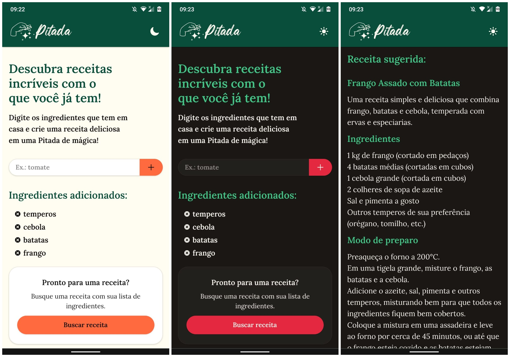
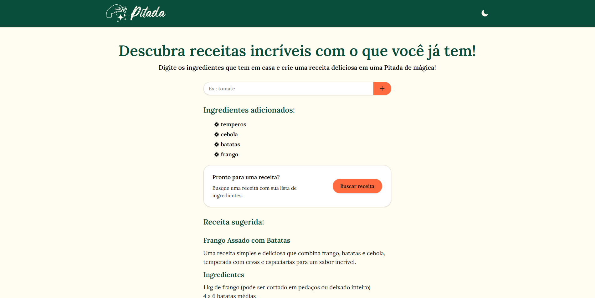

# 

<p>
  
  
  
  
  
  
</p>

**Pitada** é uma aplicação web inteligente que transforma ingredientes em receitas deliciosas usando o poder da inteligência artificial. Com uma interface responsiva e intuitiva, você pode descobrir novas possibilidades culinárias a partir dos ingredientes que tem em casa.

🔗 **Live:** https://pitada.vercel.app  
📂 **Repository:** https://github.com/diegocarmn/pitada

## 🌟 Funcionalidades

- **🤖 IA Culinária**: Gere receitas personalizadas usando inteligência artificial
- **🥗 Lista de Ingredientes**: Interface simples para adicionar e gerenciar ingredientes
- **🎨 Tema Dinâmico com Persistência**: Alterne entre modo claro e escuro com salvamento no localStorage
- **🔔 Toast de Erro**: Feedback visual para falhas na busca de receita com fechamento automático e manual
- **📱 Design Responsivo**: Interface otimizada para desktop, tablet e mobile
- **♿ Acessibilidade**: Implementação completa de ARIA e navegação por teclado
- **🚀 PWA Ready**: Manifesto configurado para instalação como app nativo
- **⚡ Performance**: Otimizada com Next.js 15.5 e React 19

## 🛠️ Tecnologias

### Frontend e Framework

- **Next.js 15.5.14**: Framework React com App Router e rotas de API
- **React 19.1.0**: Construção da interface
- **TypeScript 5**: Tipagem estática do projeto

### Estilo e UI

- **Tailwind CSS v4**: Estilização utilitária
- **@tailwindcss/typography 0.5.16**: Estilos tipográficos para conteúdo em Markdown
- **React Icons 5.5.0**: Ícones da interface
- **Motion 12.38.0**: Animações e transições

### Dados e Integrações

- **TanStack Query 5.95.2**: Mutations e gerenciamento de estado assíncrono
- **Groq SDK 0.30.0**: Cliente para geração de receitas com IA
- **React Markdown 10.1.0**: Renderização da resposta da IA em Markdown
- **Vercel Analytics 1.5.0**: Métricas de uso da aplicação

## 📸 Capturas de tela

### Mobile (PWA)



_Layout mobile (PWA)_

### Desktop



_Layout para telas desktop_

## 🚀 Instalação e Configuração

### Pré-requisitos

- Node.js 18+ ou superior
- npm, yarn, pnpm ou bun
- Chave da API Groq

### Passos de Instalação

1. **Clone o repositório**

   ```bash
   git clone https://github.com/diegocarmn/pitada.git
   cd pitada
   ```

2. **Instale as dependências**

   ```bash
   npm install
   # ou
   yarn install
   # ou
   pnpm install
   ```

3. **Configure as variáveis de ambiente**

   ```bash
   cp .env.local.example .env.local
   ```

   Adicione sua chave da API Groq no arquivo `.env.local`:

   ```env
   GROQ_API_KEY=sua_chave_api_aqui
   ```

4. **Execute o servidor de desenvolvimento**

   ```bash
   npm run dev
   # ou
   yarn dev
   # ou
   pnpm dev
   ```

5. **Acesse a aplicação**

   Abra [http://localhost:3000](http://localhost:3000) no seu navegador

## 📁 Estrutura do Projeto

```
pitada/
├── app/
│   ├── api/
│   │   └── ai/
│   │       └── recipe/
│   │           └── route.ts           # Endpoint da API de receitas
│   ├── components/
│   │   ├── Header.tsx                 # Cabeçalho
│   │   ├── ThemeToggleButton.tsx      # Botão de alternância de tema
│   │   └── Toast.tsx                  # Notificação de erro (toast)
│   ├── features/
│   │   ├── ingredients/
│   │   │   ├── IngredientsList.tsx    # Lista de ingredientes
│   │   │   └── AddIngredientForm.tsx  # Formulário de adição de ingrediente
│   │   └── recipe/
│   │       ├── GetRecipeCard.tsx      # Card com botão para buscar receita
│   │       └── AiRecipe.tsx           # Componente de exibição de receitas
│   ├── hooks/
│   │   ├── useAutoDismiss.ts          # Auto fechamento de feedbacks visuais
│   │   ├── useGetRecipe.ts            # Hook com TanStack Query para fetch de receitas
│   │   └── useScrollToRecipe.ts       # Hook para rolagem até receita
│   ├── motion/
│   │   └── animations.ts              # Variantes/animações da interface
│   ├── providers/
│   │   └── ReactQueryProvider.tsx     # Provider do TanStack Query
│   ├── types/
│   │   └── types.ts                   # Tipos e interfaces compartilhadas
│   ├── globals.css                    # Estilos globais e variáveis de tema
│   ├── layout.tsx                     # Layout raiz com metadados
│   └── page.tsx                       # Página principal
├── public/
│   ├── icons/                         # Ícones PWA e favicons
│   ├── logo.svg                       # Logo principal
│   ├── logo-full.svg                  # Logo completo
│   ├── preview.png                    # Imagem de preview
│   ├── screenshots/                   # Capturas de tela do app
│   └── manifest.json                  # Manifesto PWA
└── config files...                    # Configurações do projeto
```

## 🎯 Documentação da API

### Endpoint de Receitas

**POST** `/api/ai/recipe`

Gera uma receita personalizada baseada nos ingredientes fornecidos usando inteligência artificial.

#### Detalhes Técnicos

- **Provedor IA**: Groq
- **Modelo**: `llama-3.3-70b-versatile`
- **Temperatura**: 0.5 (equilibra criatividade e consistência)
- **Max Tokens**: 1024 (limite máximo de resposta)
- **Processamento**: Assíncrono via [TanStack Query](/app/hooks/useGetRecipe.ts)

#### Request Body

```json
{
  "ingredients": ["tomate", "queijo", "manjericão"]
}
```

**Parâmetros:**

- `ingredients` (string[]): Lista de ingredientes disponíveis (mínimo 3 recomendado)

#### Response

```json
{
  "recipe": "## Bruschetta de Tomate\n\n**Ingredientes:**\n- Tomate\n- Queijo\n- Manjericão\n\n**Modo de preparo:**..."
}
```

**Campos:**

- `recipe` (string): Receita formatada em Markdown com:
  - Nome da receita (em negrito)
  - Seção **Ingredientes**
  - Seção **Modo de preparo**

#### Códigos de Status

- `200` - Receita gerada com sucesso
- `400` - Ingredientes ausentes ou lista vazia
- `500` - Erro na geração (falha na IA ou servidor)

#### Exemplo de Uso

```typescript
// Cliente TypeScript/React
const response = await fetch("/api/ai/recipe", {
  method: "POST",
  headers: { "Content-Type": "application/json" },
  body: JSON.stringify({
    ingredients: ["frango", "alho", "tomate", "cebola"],
  }),
});

const data = await response.json();
console.log(data.recipe); // Receita em Markdown
```

#### Fluxo de Funcionamento

1. **Cliente** envia lista de ingredientes via POST
2. **Servidor** valida ingredientes (array não-vazio)
3. **Groq API** processa com modelo `llama-3.3-70b` gerando receita
4. **Resposta** retorna receita em Markdown formatado
5. **Frontend** renderiza com `react-markdown` no componente `AiRecipe`

## ♿ Acessibilidade

Implementações de acessibilidade incluem:

- **ARIA Labels**: Descrições detalhadas para screen readers
- **Navegação por Teclado**: Suporte completo para teclas Tab/Enter/Space
- **Contraste de Cores**: Paleta otimizada para legibilidade
- **Foco Visível**: Indicadores claros de elementos focados
- **Semântica HTML**: Estrutura semanticamente correta

## 📱 PWA (Progressive Web App)

A aplicação está configurada como PWA com:

- **Manifesto Completo**: Ícones e configurações para instalação
- **Ícones Responsivos**: Suporte para diferentes resoluções
- **Splash Screen**: Tela de carregamento personalizada
- **Tema da Barra**: Cor da interface do sistema

## 📄 Licença

Este projeto está sob a licença MIT. Veja o arquivo [LICENSE](./LICENSE.md) para mais detalhes.

## 👤 Autor

Diego Carmona - Software Developer

- Portfolio: https://diegocarmona.me/
- GitHub: https://github.com/diegocarmn
- LinkedIn: https://linkedin.com/in/diegocarmn

---

<p align="center">🎧 Desenvolvido com código, curiosidade e uma boa  playlist.</p>
